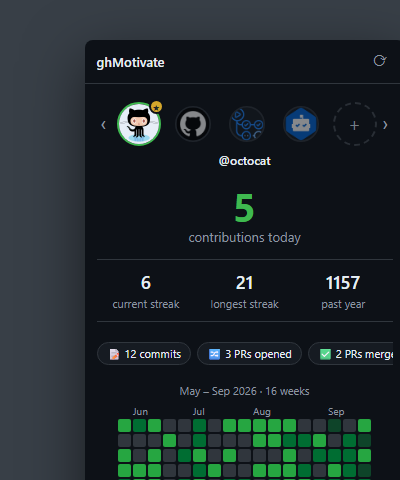

# ghMotivate

Checking your GitHub contributions throughout the day is a nice little hit of dopamine and motivation. Getting to it shouldn't be the annoying part.

## The problem this solves

Without an extension, "checking your contributions" means: open your GitHub profile, scroll down to the contribution calendar, and read off the numbers — commits, issues, PRs. Do that more than once or twice a day and it gets old fast:

- You end up opening your GitHub profile over and over.
- Keeping it open in a tab doesn't help — it just gets lost among all your other tabs.
- Even when you find it, the page is stale until you manually refresh it.

ghMotivate turns that into a single click. Your streak, today's count, and a heatmap live in the toolbar — no tab to hunt for, no refresh to remember, no profile page to wait on. It also nudges you with milestone notifications so a busy day doesn't quietly break a streak, and can watch your teammates' or friends' streaks alongside your own.

## Why you'd want this

- **Zero-friction check-in.** Click the toolbar icon instead of navigating to `github.com/<you>` and waiting for the page to render.
- **Nothing to hunt for, nothing to refresh.** Data refreshes itself on a background alarm, so the popup is never the stale tab you forgot to reload.
- **You won't lose a streak by accident.** The badge shows today's count at all times (red `!` if a fetch fails), and milestone notifications (7/30/50/100/200/365-day streaks, new records, first contribution of the day) fire the moment they happen — even if the popup is closed.
- **Private contributions included.** Most streak trackers only see public activity. ghMotivate fetches your calendar with your own github.com session, so private-repo commits count too — nothing leaves your machine except a request to `github.com`/`api.github.com`.
- **Track more than yourself.** Add teammates' or friends' usernames and flip between them in an avatar carousel.
- **Weekly/monthly recaps** summarize your best day and total, so you get a "here's what you did" moment without digging through commit history.
- **No account, no server, no telemetry.** Everything is a static, unpacked extension talking directly to GitHub. Nothing to sign up for, nothing to trust beyond GitHub itself.

## Install

This isn't on the Chrome Web Store — load it as an unpacked extension:

1. Clone or download this repository.
2. Go to `chrome://extensions`, enable **Developer mode** (top right).
3. Click **Load unpacked** and select the `ghMotivate` folder.
4. Click the toolbar icon, enter your GitHub username, and hit **Track**. For your own private contributions to count, make sure you're logged into `github.com` in the same browser.

Works in any Chromium-based browser (Chrome, Edge, Brave, etc.) since it's a standard Manifest V3 extension.

## Using it

- **Popup** (click the toolbar icon) — today's count, current/longest streak, past-year total, a PR/issue/review breakdown, and a 16-week heatmap for whichever profile is selected.
- **Carousel** — click an avatar to switch profiles, `+` to track another username, double-click an avatar to stop tracking it. The starred avatar is your **primary** profile — the one that drives the badge, breakdown, and recaps.
- **⟳** — force an immediate refresh instead of waiting for the next automatic one (every 10 minutes by default).

## Permissions

| Permission | Why |
|---|---|
| `storage` | Persist tracked profiles, cached data, settings |
| `alarms` | Periodic background refresh |
| `notifications` | Milestone celebration notifications |
| `host_permissions: github.com, api.github.com` | Fetch contribution calendars (with cookies) and public event data |

No analytics, no third-party network calls — every request goes to `github.com` or `api.github.com`.

## Contributing

Contributions are welcome! This is currently a very small, hand-built codebase — there's no linting setup and no test suite, so everything is verified manually by loading the extension and checking it in the browser. See Install above to load your own working copy.

## Known limitations

- The PR/issue/review breakdown only reflects public activity from roughly your last 300 GitHub events, so very active accounts may see an incomplete picture.
- Private contributions only show up for whichever GitHub account you're logged into in the same browser.
